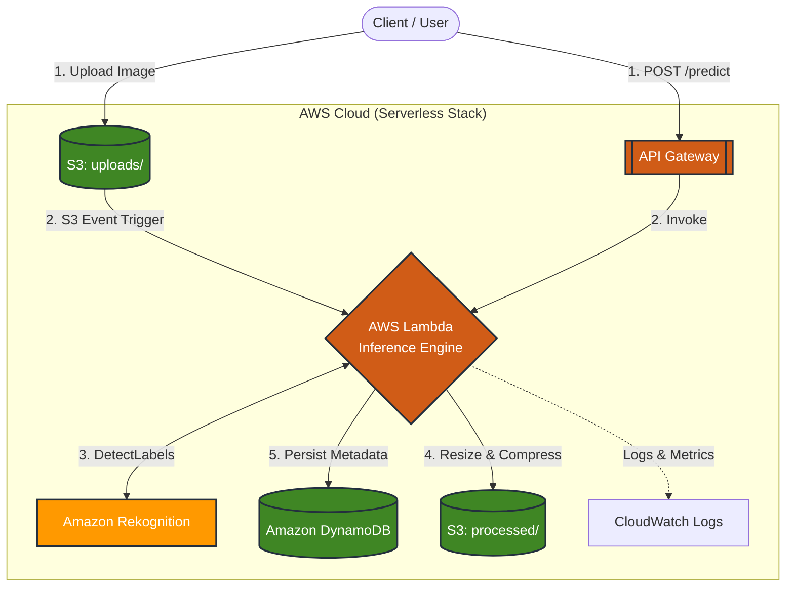

# Serverless Cat vs Dog Image Inference (AWS)

A production-style **serverless computer vision pipeline** on AWS that classifies **cat vs dog** images using **Amazon Rekognition**, supports both **S3 event-driven inference** and **on-demand REST API** inference, and persists results to **DynamoDB**.

## Key Features

- **Cat vs Dog classification** using `rekognition:DetectLabels` with confidence scoring
- **Two inference modes**
  - **Async**: Upload an image to `s3://<bucket>/uploads/` → automatically triggers Lambda
  - **Sync**: Call `POST /predict` via API Gateway to run inference on an existing S3 object
- **Image preprocessing** with **Pillow (Lambda Layer)**: resize + JPEG compression, outputs to `processed/`
- **Metadata storage** in **DynamoDB**: prediction, confidence, latency, file size, request ID
- **Observability** via **CloudWatch Logs**
- **API protection** via `x-api-key` shared-secret authentication (prevents unauthorized calls)

---
## System Overview

This project implements a robust, event-driven image processing pipeline. It is designed to handle binary image data across two distinct execution paths, ensuring both flexibility for real-time requests and scalability for bulk uploads.

### Execution Flow

The system operates through two primary entry points:

1.  **Synchronous Path (REST API):**
    * A client sends a `POST` request to **Amazon API Gateway** with a reference to an existing S3 object.
    * API Gateway triggers the **Lambda Inference Engine**, which performs immediate classification and returns the result (label and confidence) in the HTTP response.
    * *Ideal for:* Real-time UI feedback and interactive applications.

2.  **Asynchronous Path (Event-Driven):**
    * A client uploads a raw image directly to the `/uploads` prefix of the **S3 Bucket**.
    * An **S3 Event Notification** automatically triggers the Lambda function.
    * The function processes the image in the background without requiring the client to wait.
    * *Ideal for:* Batch processing and high-throughput data ingestion.

### Core Logic & Transformation

Regardless of the trigger, the **Lambda Inference Engine** performs the following atomic operations:
* **Intelligence:** Calls **Amazon Rekognition** to identify "Cat" vs "Dog" labels.
* **Optimization:** Uses **Pillow** to resize and compress the image, saving storage costs and improving downstream loading speeds.
* **Persistence:** Writes a standardized record to **Amazon DynamoDB**, including a unique `request_id`, classification results, and processing latency for auditing.

---
## Architecture



---
## Tech Stack

| Category | Service / Tool | Description |
| :--- | :--- | :--- |
| **Compute** | **AWS Lambda** | Python-based serverless execution for inference logic and image processing. |
| **API Management** | **Amazon API Gateway** | RESTful endpoint provider with API Key authentication and request throttling. |
| **AI / ML** | **Amazon Rekognition** | Managed deep learning service used for high-accuracy Cat vs. Dog label detection. |
| **Storage (Object)** | **Amazon S3** | Dual-bucket strategy: `/uploads` for raw ingestion and `/processed` for optimized output. |
| **Database (NoSQL)** | **Amazon DynamoDB** | Single-table design for persisting inference metadata and processing telemetry. |
| **Image Processing** | **Pillow (PIL)** | Deployed via **Lambda Layers** for on-the-fly resizing and JPEG optimization. |
| **Monitoring** | **Amazon CloudWatch** | Real-time logging, custom metrics for latency, and error tracking. |
| **Security** | **AWS IAM** | Granular execution roles following the Principle of Least Privilege (PoLP). |

---
## API Usage

The system exposes a synchronous REST endpoint for real-time inference. Access is protected via an **API Key** shared-secret mechanism.

### Authentication
All requests must include the `x-api-key` header.
- **Header Name:** `x-api-key`
- **Value:** `Your-Provisioned-API-Key`

### Synchronous Prediction
Run inference on an image already stored in an S3 bucket.

**Endpoint:** `POST /predict`

### Request Example

#### Standard (Bash / Zsh)
```bash
curl -X POST "[https://r5ah2t7lfg.execute-api.us-east-1.amazonaws.com/predict](https://r5ah2t7lfg.execute-api.us-east-1.amazonaws.com/predict)" \
  -H "Content-Type: application/json" \
  -H "x-api-key: MY_API_KEY" \
  -d '{
    "bucket": "ds-serverless-image-pipeline-cc",
    "key": "uploads/Dog1.jpg"
  }'
```

### Expected Response (`200 OK`)

The service returns a structured JSON object containing the classification results from Rekognition and performance metrics from the Lambda execution.

```json
{
  "status": "success",
  "request_id": "a1b2c3d4-e5f6-7890-abcd-1234567890ab",
  "inference": {
    "label": "Dog",
    "confidence": 99.42,
    "source_object": "uploads/Dog1.jpg"
  },
  "processing": {
    "optimized_s3_url": "s3://ds-serverless-image-pipeline-cc/processed/Dog1.jpg",
    "latency_ms": 425,
    "timestamp": "2026-03-03T22:40:00Z"
  }
}
```

---

## Project Structure 
To wrap up your README, here is a standard layout. Adjust the file names if yours are slightly different:

```text
aws-serverless-image-inference/
├── lambda/
│   └── lambda_function.py      # Core logic (Rekognition, S3 & DynamoDB)
├── layer/
│   └── build_pillow_layer.sh   # Automation script for Docker-based builds
├── docs/
│   └── architecture.md         # Detailed system design & event flow
├── README.md                   # Main project documentation
├── requirements.txt            # Local development dependencies
└── .gitignore                  # Git exclusion rules
```
