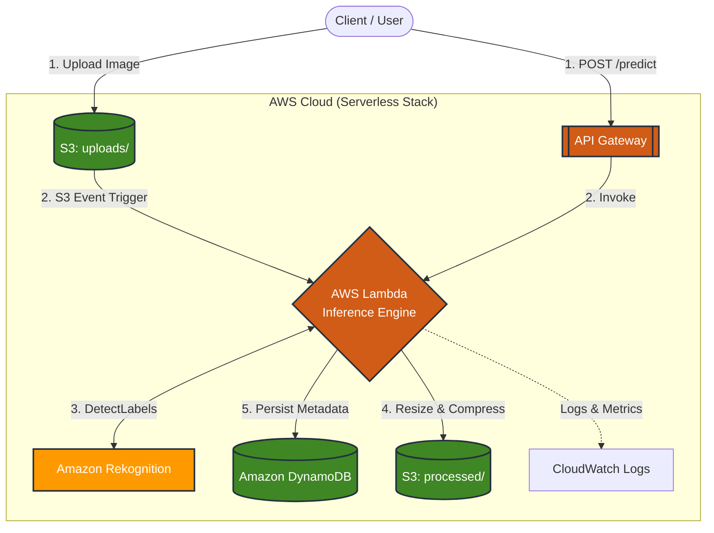

# System Architecture

This document describes the technical architecture of the **Serverless Image Inference Pipeline** built on AWS.

The system processes images uploaded to Amazon S3, performs classification using Amazon Rekognition, resizes images using Pillow, and persists metadata in DynamoDB.


## 1. High-Level Architecture

The following diagram illustrates the serverless flow and service integration:



---

## 2. Event Flow

The system supports two primary execution paths for triggering inference logic.

### 1.1 Event-Driven Pipeline (Primary)
This path enables fully automated processing as soon as data enters the system.
1. **User Upload:** User uploads an image to the S3 bucket under the `uploads/` prefix.
2. **S3 Event:** S3 triggers an event notification to AWS Lambda.
3. **Classification:** Lambda invokes Amazon Rekognition (`DetectLabels`).
4. **Processing:** Lambda uses the Pillow library to resize/compress the image.
5. **Storage:** The processed image is saved to S3 (`processed/`).
6. **Persistence:** Metadata and inference results are saved to DynamoDB.

### 1.2 On-Demand API Inference
Allows external applications to trigger inference on existing S3 objects via REST.
1. **Client Request:** User sends a `POST /predict` request to API Gateway.
2. **Lambda Trigger:** API Gateway invokes the Lambda function.
3. **Execution:** The same Rekognition and processing logic is applied.
4. **Response:** The system returns a JSON response with the classification result.

**Example API Request:**
```json
{
  "bucket": "ds-serverless-image-pipeline-cc",
  "key": "uploads/Cat2.jpg"
}

---

## 3. AWS Services Used

### **Amazon S3**
* **Purpose:** Acts as the primary entry and exit point for all image data.
* **Prefix Structure:**
    * `uploads/`: Landing zone for raw, high-resolution images.
    * `processed/`: Storage for optimized, resized, and compressed images.
* **Features:** Utilizes **S3 Event Notifications** to trigger the Lambda workflow automatically upon a successful object upload.

### **AWS Lambda**
* **Purpose:** The central serverless compute layer orchestrating the entire inference pipeline.
* **Responsibilities:** * Parsing S3 event metadata and API Gateway request bodies.
    * Orchestrating calls to Amazon Rekognition.
    * Executing image transformation logic (resizing/compression).
    * Managing state persistence by writing to DynamoDB.
* **Advantages:** Zero infrastructure management, automatic horizontal scaling, and a cost-effective pay-per-request billing model.

### **Amazon Rekognition**
* **Purpose:** Provides a managed deep-learning interface for computer vision.
* **Implementation:** Leverages the `DetectLabels` API.
* **Logic:** The system filters results to map detected labels into simplified categories: `cat`, `dog`, or `other`, while recording confidence scores for auditability.

### **Amazon DynamoDB**
* **Purpose:** A high-performance NoSQL database used to store inference metadata and processing telemetry.
* **Data Schema Example:**
```json
{
  "pk": "s3://bucket/uploads/Cat2.jpg",
  "sk": "2026-03-03T22:14:47Z",
  "pred_class": "cat",
  "confidence": 99.86,
  "processed_key": "processed/Cat2_512.jpg",
  "latency_ms": 5166
}
```
